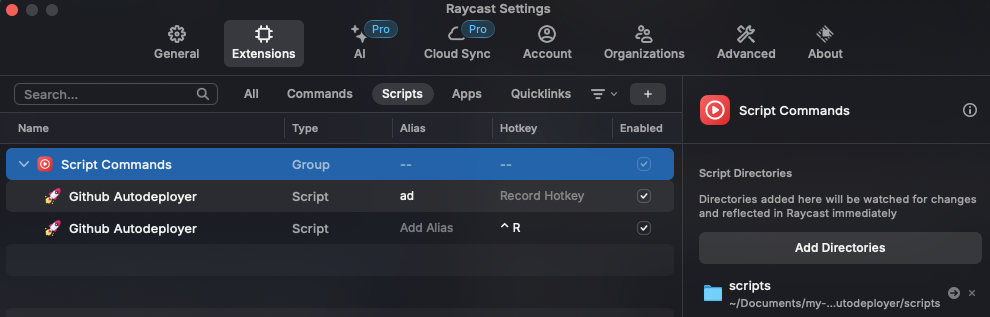

# Autodeployer

## Why use this script?

This script was built to automate the process of creating releases and deploying them to staging. By running a single command, it will take care of creating the release, bumping the deployment repo, and running the deployment workflow, and notify you of the result of the deployment when it is done.

## What happens when you run the script?

When you run the script, it will take ~5 seconds to create the releases and create or bump the deployment repo. It will then run the 'deploy' workflow in the deployment repo. This usually takes around 5-10 minutes. When the workflow is completed, you will be notified by a popup on your screen notifying you of the result of the deployment.

## How to use

### Prerequisites

There are no required prerequisites but if you would like to not specify the repository and branch every time you run the script, you can set the `AD_REPO` and `AD_BRANCH` environment variables to the repository and branch you want to deploy. By default, the script will use the `AD_REPO` and `AD_BRANCH` environment variables if they are set, otherwise it will expect you to provide the repository and branch as arguments. You can set the environment variables by adding the following lines to your `.zshrc` or `.bashrc` file:

```text
export AD_REPO=<repository>
export AD_BRANCH=<branch>
```

There are 4 ways to use this script:

### 1. Raycast:



As shown in the image above, go to your raycast extensions settings. In there, go to the scripts tab and add a new script directory.

Once you have added the script directory of this repository, you should be able to see the autodeployer scripts in the raycast menu. One being the script that takes arguments and the other being the script that doesn't take any arguments. Don't forget to make aliases and hotkeys to make it easier to run the script!

### 2. Apple script:

Run the apple script:
```bash
osascript scripts/raycast.applescript <repository> <branch>
```

you can also run the applescript that doesn't need any arguments:
```bash
osascript scripts/raycast_noargs.applescript
```

### 3. Go run:

Run the autodeployer module:
```bash
go run github.com/psycho-baller/autodeployer <repository> <branch>
```

### 4. Binary/Executable:

Run the autodeployer binary:
```bash
./bin/autodeployer
```

If you want to be able to run this script from anywhere, you can make an alias for the script in your `.zshrc` or `.bashrc` file:

```text
alias ad="$HOME/path-to-repository/autodeployer/bin/autodeployer"
```
now you can run the script from anywhere by typing `ad` in your terminal.

#### Building the binary

If you want to update the binary, you can build it by running the following command:

```bash
go build -o bin/autodeployer github.com/psycho-baller/autodeployer`
```

## Things you should know before using this script

- By default, the script assumes you don't want to make a new release after someone else has made the previous rc
  - Example: Say someone else makes `rc-2` for a certain branch, you now want to make `rc-3` for the same branch. You will need to modify the default behavior of filtering the tags to only include the ones that you have made
- It also assumes that you are making a minor bump to the version
  - Example: Currently latest version of some branch is `1.2.3`, default behavior will be to make `1.2.4-rc*` if you want to make `1.3.0-rc*` or `2.0.0-rc*`, you will need to modify the default behavior
- It assumes that you do not manually create tags for the release candidates without updating the deployment repo. Always make sure that the deployment repo is up to date with the latest rc tag created
- It assumes you have 1password set up and have the `GHEC_TOKEN` saved in your private vault


## Future improvements

- Tell the user if the deployment failed (easy, semi-quick)
- Add support for making major and patch bumps to the version (easy, quick)
- Handling the case where a certain repo has different files that need to be bumped (like flo) (medium, not so quick)
- How the hell do I make this work for portals?
